

  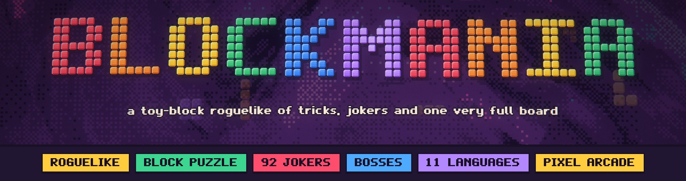

  
  
  
  

  <b>Place blocks. Clear lines. Break the machine.</b> 
  A single-player roguelike where an 8×8 block puzzle meets a deck of rule-bending Jokers, 
  escalating bosses and a scoring engine that can reach a quadrillion points.

<h2 align="center">⬇ Play the free demo</h2>

  
  
  

  

  Free, no install, no account. Unzip and play. 
  <b>Windows:</b> double-click <code>BLOCKMANIA.exe</code> (if SmartScreen appears: <i>More info → Run anyway</i>). 
  <b>Mac:</b> drag <code>BLOCKMANIA.app</code> to Applications, then <i>right-click → Open</i> the first time. 
  <b>Linux:</b> run <code>BLOCKMANIA.x86_64</code>. 
  In-development build · not code-signed yet · every version on the <a href="https://github.com/ElMariones/blockmania-demo/releases">Releases page</a>

**The demo** is Act 1 of the full game: pick a Kit, play four rounds, shop for Jokers between them and take on the first boss. **Endless** and the **Daily run** are in too. Your demo run is saved, and the full game picks it up at the shop.

  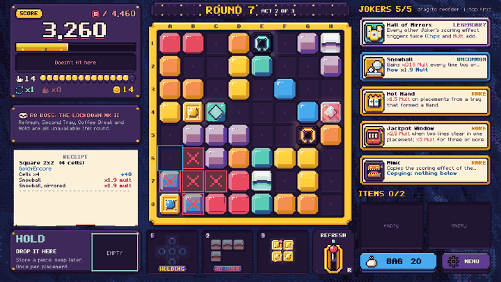

  🎬 Short clips: <a href="media/clip_gameplay.mp4">gameplay</a> · <a href="media/clip_boss.mp4">boss entrance</a>

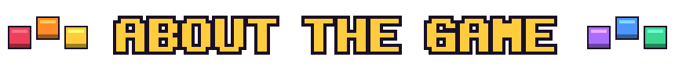

**BLOCKMANIA** starts as the block puzzle everyone knows: three pieces in your tray, an 8×8 board, fill a row or a column and it clears. Then it gets out of hand.

Every piece comes from **your own bag**, and you can upgrade it: chrome that pays Chips, neon that adds Mult, gold that prints Credits, glass that shatters for a multiplier. Between rounds the **Toybox** sells **Jokers**, 92 rule-bending cards. They grow with every clear, copy their neighbours, pay you for patience or double everything the others do. Each placement is scored as **Chips × Mult**, and every number is itemized on a receipt so you always know why a move was worth 12 points or 12 million.

Twelve rounds, three acts, and a boss at the end of each act that rewrites one rule. Beat round 12 and the machine offers **Overtime**: targets explode, bosses return as **Mk II**, and the only way out is losing, or scoring one quadrillion points in a single placement and **breaking the machine**.

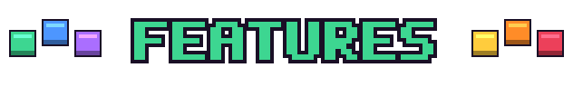

<table>
<tr>
<td width="55%">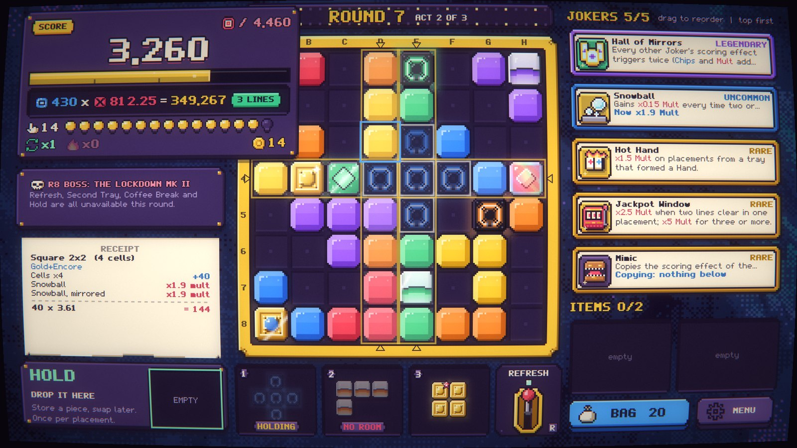</td>
<td>
<h3>A puzzle you read at a glance</h3>

Carry a piece and the board shows exactly where it fits, which lines it completes and what it will score (<b>Chips × Mult = points</b>), before you commit. No hidden rolls, no timers: every result is decided by the rules and only <i>shown</i> by the effects.

</td>
</tr>
<tr>
<td>
<h3>92 Jokers, 4 of them Legendary</h3>

Chips, Mult and ×Mult cards, color and shape cards, economy cards, cards that grow for the whole run, and cards that copy the one next to them. Order matters. The four <b>Legendaries</b> change how the game plays: <b>The Avalanche</b> adds gravity and chain waves, <b>Hall of Mirrors</b> makes every Joker trigger twice, <b>Philosopher's Stone</b> turns your bag to metal, <b>Supernova</b> builds each round to a crescendo.

</td>
<td width="55%">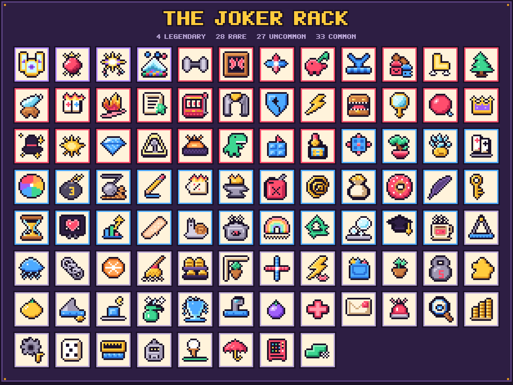</td>
</tr>
<tr>
<td width="55%">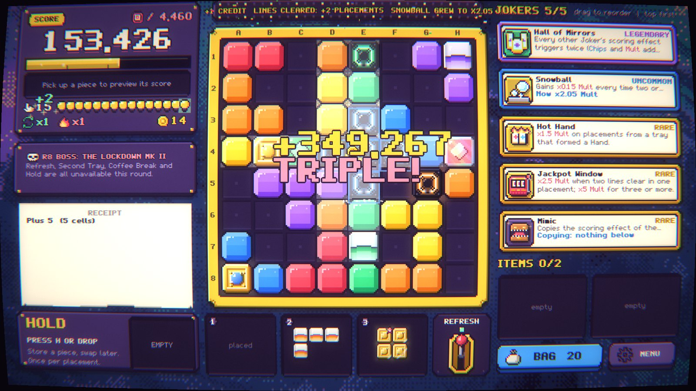</td>
<td>
<h3>Big, loud, readable payoffs</h3>

Lines flash, blocks burst in the style of their finish, Jokers fire one by one in scoring order with their own sound, and the score rolls up a tube. A CRT filter, a living shader background and arcade particles give it the glow. Reduced Motion keeps every number.

</td>
</tr>
<tr>
<td>
<h3>Bosses with an entrance</h3>

Each act ends with a boss that bends one rule: fixed blocks, a tax on your first line, barred tray slots, a tombstone every third move. Later they come back as <b>Mk II</b>, with a warning cinematic, a hazard-tape frame and their own music.

</td>
<td width="55%">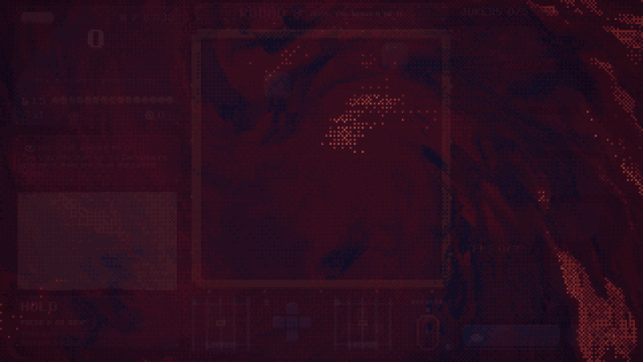</td>
</tr>
<tr>
<td width="55%">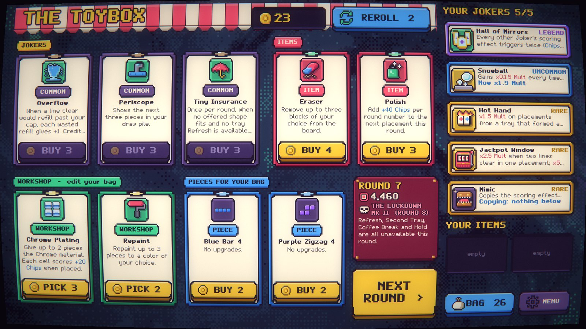</td>
<td>
<h3>Build your bag, not just your deck</h3>

The Toybox sells Jokers and items (a throwable brick, an eraser, a second tray), plus <b>Workshop</b> upgrades that edit the pieces themselves: repaint, rotate, copy, remove, add materials and stamps. Save your Credits for interest, or overkill a target for a bonus.

</td>
</tr>
<tr>
<td>
<h3>Choose how hard the next round is</h3>

Before each normal round, pick <b>Standard</b> or a twist: <i>Double or Nothing</i>, <i>Gold Rush</i>, <i>Rush Hour</i>, <i>Mult Fever</i>, <i>Treasure Hunt</i>... Keep one piece in reserve with <b>Hold</b>, and read your bag's odds before you commit.

</td>
<td width="55%">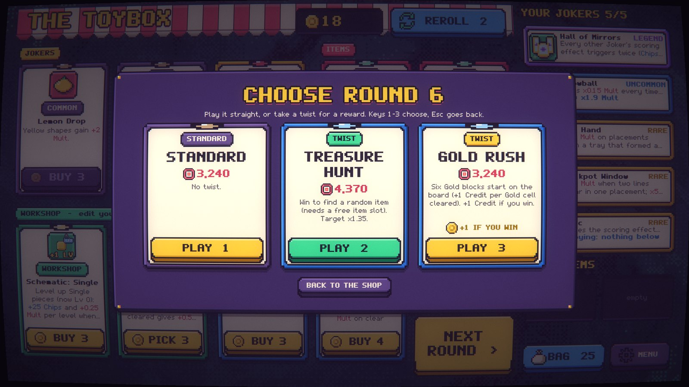</td>
</tr>
</table>

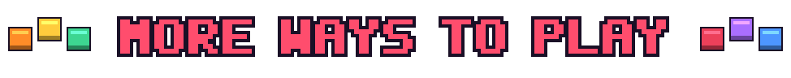

- **Seven Kits** with different starter bags, rules and a signature perk, unlocked by playing.
- **Heat 0–5**: win a run to unlock the next stake.
- **Daily run**: one seed per day, the same game for everyone. Local, no account.
- **Overtime** after the final boss, all the way to breaking the machine.
- **Endless**: a relaxed arcade mode with a ×10 combo ladder, Hold, 15 block styles and a local top ten.
- **61 achievements**, an **Almanac** of everything you have met, and practice seeds.
- **Eleven languages**: English, Español, Français, Italiano, Deutsch, Nederlands, Polski, Português (BR), 日本語, 简体中文 and 繁體中文.
- **Mouse, keyboard or controller**, with button glyphs for your pad. Steam Deck ready.
- **POPS**, the arcade's old caretaker bot, shows you around on your first run.

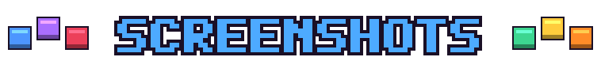

| | |
|:---:|:---:|
| 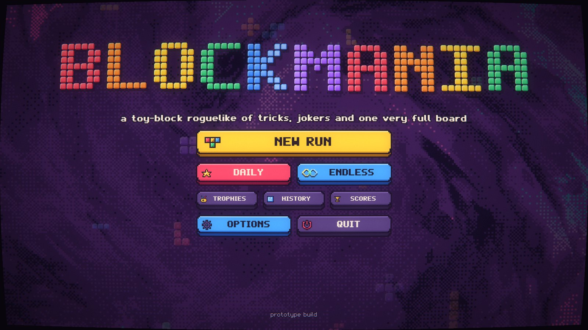 | 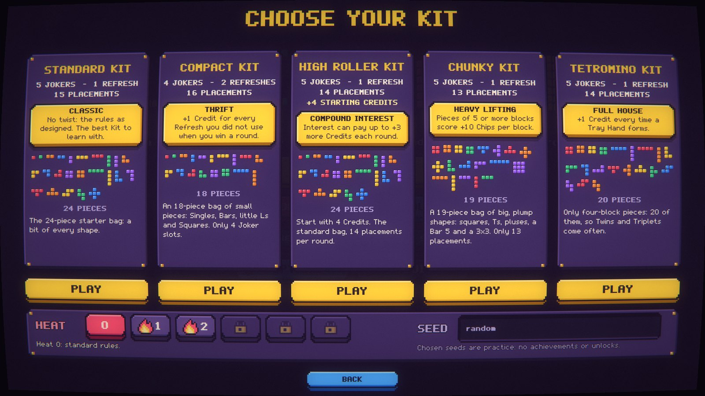 |
| **Title**: the logo is made of blocks, and you can knock the letters out | **Kits and Heat**: pick a starter bag and a stake |
| 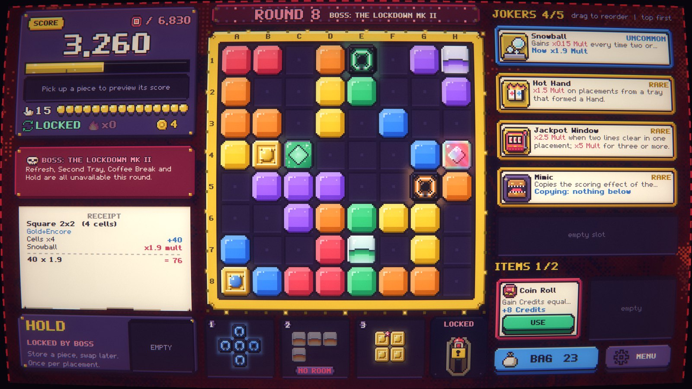 | 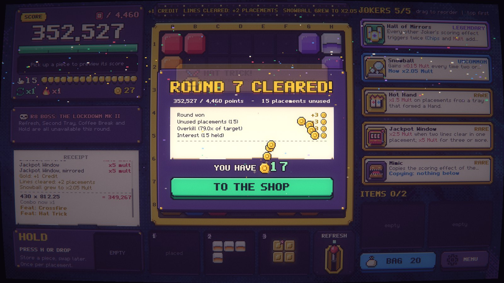 |
| **Boss round**: The Lockdown Mk II locks Refresh and Hold | **Round won**: every Credit itemized |
| 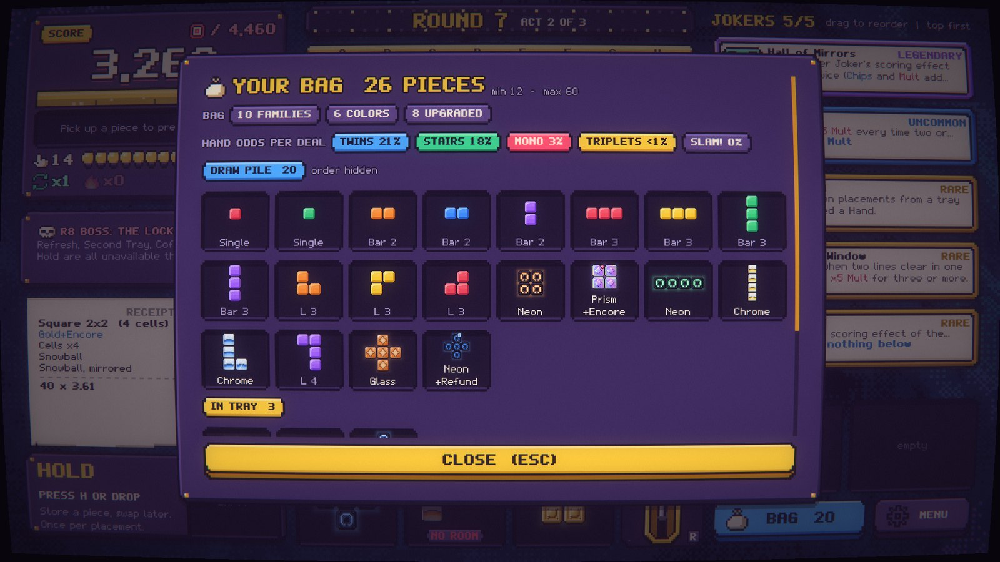 | 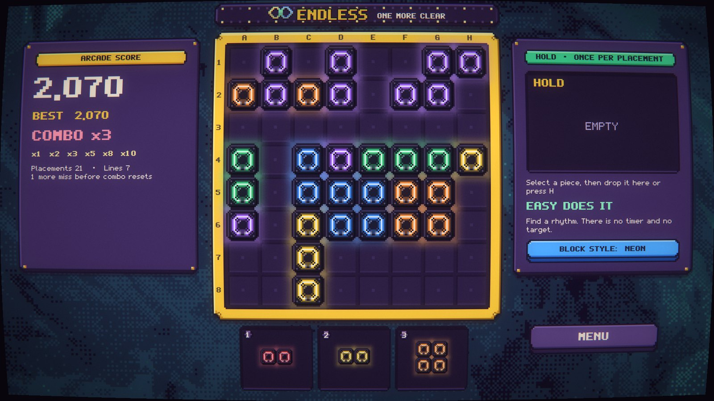 |
| **Your bag**: every piece, and the odds of the next deal | **Endless**: combo ladder, Hold and 15 block styles |

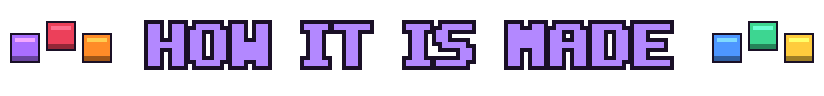

Everything you see and hear in BLOCKMANIA is original and **authored as code**: pixel art drawn by scripts, an original pixel font built glyph by glyph, about 160 synthesized sound effects and 13 music tracks, and shaders for the swirl background and the CRT. No stock assets and no image-generator art. Made with the Godot engine.

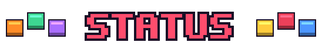

BLOCKMANIA is in development, coming to **Steam** for Windows, macOS and Linux. Balance numbers are still being tuned. Found a bug or have feedback on the demo? [Open an issue](https://github.com/ElMariones/blockmania-demo/issues).

**Author:** Mario Landáburu ([@ElMariones](https://github.com/ElMariones)): design, code, art and audio.
© Mario Landáburu. All rights reserved. This repository holds the demo builds and media; the game's source is not public.
